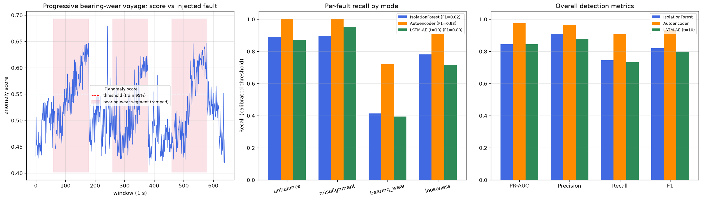

<p align="center">
  <a href="README.md">English</a> | <a href="README.ko.md">한국어</a>
</p>

<h1 align="center">선박 추진축계 CBM 이상탐지</h1>

<p align="center">선박 추진축 상태기반정비(CBM) — MLflow로 추적하는 3종 비지도 탐지 모델, Streamlit 모니터링 대시보드, 라벨 있는 합성 결함 벤치마크 (최고 F1 0.93)</p>

<p align="center">
  
  
  
  
</p>

선박 추진축의 진동·RPM 센서는 라벨 없는 데이터를 끊임없이 쏟아냅니다. 이 프로젝트는
그 스트림의 정상 신호 패턴을 3종의 비지도 모델 — **Isolation Forest**, **Dense
Autoencoder**, **LSTM Autoencoder** — 로 학습하고, 모든 학습 런을 MLflow로 추적하며,
이상 원인 귀속(어느 센서가 몇 σ 벗어났는가)을 제공하는 Streamlit 운영 대시보드로
서빙합니다.

실데이터에 라벨이 없으므로 "윈도우의 X%가 이상으로 판정됨"이라는 보고는 *올바른*
윈도우가 판정됐는지를 전혀 말해주지 못합니다. 그래서 이 저장소는 **물리 기반 합성
결함 벤치마크**를 포함합니다: 회전기계의 고전적 결함 4종을 라벨과 함께 모의 축계
진동에 주입하고, 3개 모델을 Precision/Recall/F1로 채점합니다 — 임계값은 정상
데이터만으로 보정하며, 테스트 라벨로 튜닝하지 않습니다.

## 데이터

원본 센서는 비공개입니다(한국해양대 실습선 *한바다* 추진축계 모니터링): 회전속도계
(`RTTN_SPDMTR`)와 4개 진동 채널(축계 하단/상단, 수직, 수평)을 1초 윈도우 단위로
mean / std / RMS / peak-to-peak / kurtosis / skewness 로 요약한 특징입니다.

원자료를 재배포할 수 없으므로 `evaluation/synthetic_data_generator.py` 가 같은
스키마의 대체 데이터를 생성합니다: 정상 상태는 1×/2×/3× RPM 고조파 합성 + 원심력
진폭 스케일링 + 센서 잡음으로, 결함 4종은 채널별 감도 프로필과 함께 주입합니다:

| 결함 | 물리적 신호 | 특징 반응 |
|---|---|---|
| 불평형 (unbalance) | 1×RPM 진폭 증가, 반경방향 우세 | RMS / p2p ↑ |
| 정렬불량 (misalignment) | 2× (및 3×) 고조파, 축/수평방향 | RMS ↑, 파형 변화 |
| 베어링 마모 (bearing wear) | 결함 주파수의 주기적 충격 임펄스 | Kurtosis ↑↑ |
| 기계적 풀림 (looseness) | 0.5× 아저조파 + 광대역 버스트 | Std / skewness ↑ |

모든 결함 구간은 **심각도가 0.15 → 1.0으로 점진 증가**(진행성 열화)하므로 초기
저심각도 윈도우는 정말로 어렵습니다 — 완전히 진행된 고장만이 아니라 조기 탐지를
평가하는 벤치마크입니다.

## 벤치마크 결과

정상 학습 윈도우 2,000개; 테스트 윈도우 2,900개 중 결함 1,440개(4종 × 3항차).
임계값 = 학습 점수의 95% 분위수. `python evaluation/synthetic_fault_eval.py` 로 재현:

| 모델 | PR-AUC | Precision | Recall | F1 | 불평형 | 정렬불량 | 베어링 | 풀림 |
|---|---|---|---|---|---|---|---|---|
| Isolation Forest | 0.845 | 0.91 | 0.75 | 0.82 | 89% | 90% | 41% | 78% |
| **Dense Autoencoder** | **0.975** | **0.96** | **0.91** | **0.93** | **100%** | **100%** | **72%** | **91%** |
| LSTM-AE (t=10) | 0.846 | 0.88 | 0.73 | 0.80 | 87% | 95% | 39% | 72% |



**라벨이 드러낸 것:**

- **Dense Autoencoder의 확실한 우세** (F1 0.93) — 정상 특징의 결합 분포를 재구성해
  어떤 방향의 이탈에도 반응하며, 불평형·정렬불량은 100% 탐지.
- **베어링 마모가 공통 병목** (recall 39~72%): 신호가 거의 kurtosis에만 실리는데,
  저심각도 구간에서는 충격 임펄스가 잡음에 묻힙니다. "윈도우 5% 판정" 식 보고로는
  절대 드러나지 않았을 정직한 약점이며 — 다음 단계로 포락선 스펙트럼(envelope
  spectrum) 특징 도입의 근거가 됩니다.
- **LSTM-AE는 비용값을 못 합니다**: 순항 RPM이 느리게 변하는 조건에서 시간 문맥은
  신호가 아니라 잡음을 보탭니다(오경보율도 10.9%로 최고). 시퀀스 모델이 점 단위
  모델을 이기려면 시간 구조를 가진 결함(과도 이벤트 등)이 필요합니다.

## 저장소 구조

| 경로 | 내용 |
|---|---|
| `training/train_models_mlflow.py` | 3개 모델 학습, 파라미터/메트릭/아티팩트/모델을 MLflow에 기록 |
| `training/anomaly_cause_analysis.py` | 최신 런을 로드해 각 이상을 최대 이탈 센서로 귀속 |
| `evaluation/synthetic_data_generator.py` | 물리 기반 축계 진동 시뮬레이터 (정상 + 결함 4종, 라벨 포함) |
| `evaluation/synthetic_fault_eval.py` | 라벨 기반 벤치마크: 모델별 PR-AUC / P / R / F1, 결함별 recall |
| `app.py`, `pages/` | Streamlit 대시보드: 실시간 탐지, 배치 분석, 통계/트렌드, 설정 |
| `utils/model_utils.py` | 모델 로딩(최신 MLflow 런 자동 해석), 예측, 원인 귀속 |
| `docs/` | 모델 선택 가이드, 대시보드 가이드, 시각화 해석 가이드, AWS 배포 노트 |

## 빠른 시작

```bash
pip install -r requirements.txt

# 1. 합성 대체 데이터 생성 (preprocessed_shaft_data.parquet 생성)
python evaluation/synthetic_data_generator.py

# 2. 3개 모델 학습 + MLflow 추적
python training/train_models_mlflow.py
mlflow ui --port 5000          # http://localhost:5000 에서 런 확인

# 3. 모니터링 대시보드 실행 (최신 Isolation Forest 런 사용)
streamlit run app.py

# 4. 라벨 기반 벤치마크 재현 (단독 실행 — MLflow 불필요)
python evaluation/synthetic_fault_eval.py
```

## 대시보드

운영 관점의 4개 페이지: **실시간 탐지**(윈도우 단위 점수 + 센서별 원인 귀속),
**배치 분석**(CSV/parquet 업로드 일괄 채점), **통계/트렌드**(이상률 이력),
**설정**(모델 정보, 임계값 조정). 컨테이너 배포용 `Dockerfile` 포함;
[docs/AWS_DEPLOYMENT.md](docs/AWS_DEPLOYMENT.md) 참고.

## 한계

- 벤치마크는 합성입니다: 결함 신호는 회전기계 교과서 이론을 따르지만, 실제 축계
  데이터에는 시뮬레이터가 모델링하지 않는 해상 상태 하중, 선체 전달 진동, 센서
  드리프트가 있습니다. 수치는 **동일 조건에서의 모델 간 비교**용이지 절대적 현장
  성능이 아닙니다.
- 실데이터 파이프라인은 여전히 비지도입니다. 합성 벤치마크로 고른 모델도 정비
  일지와의 대조를 통한 현장 검증이 필요합니다.

## 관련 프로젝트

- [Vehicle-Anomaly-Algorithm](https://github.com/chaeminyoon/Vehicle-Anomaly-Algorithm) — 도로 CCTV 궤적 이상탐지 (같은 "정직한 평가" 방법론)
- [AIS-Traffic-Model](https://github.com/chaeminyoon/AIS-Traffic-Model) / [AIS-Traffic-Ops](https://github.com/chaeminyoon/AIS-Traffic-Ops) — 해상 교통 예측 연구 & MLOps
